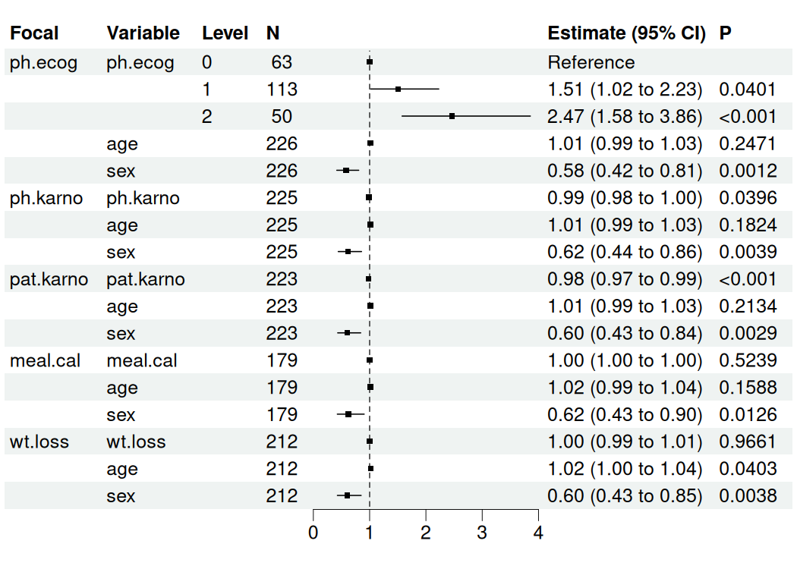
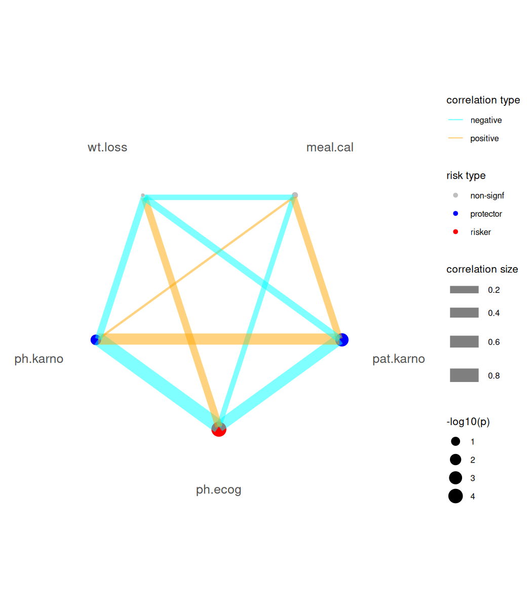
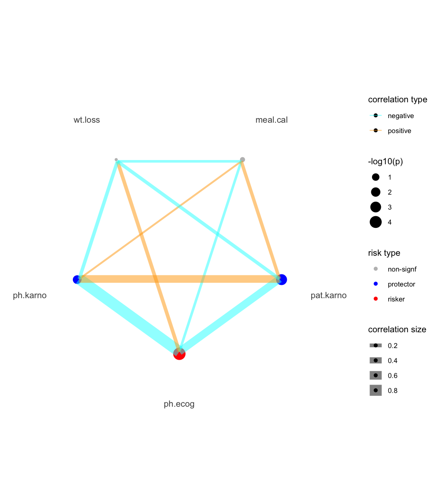
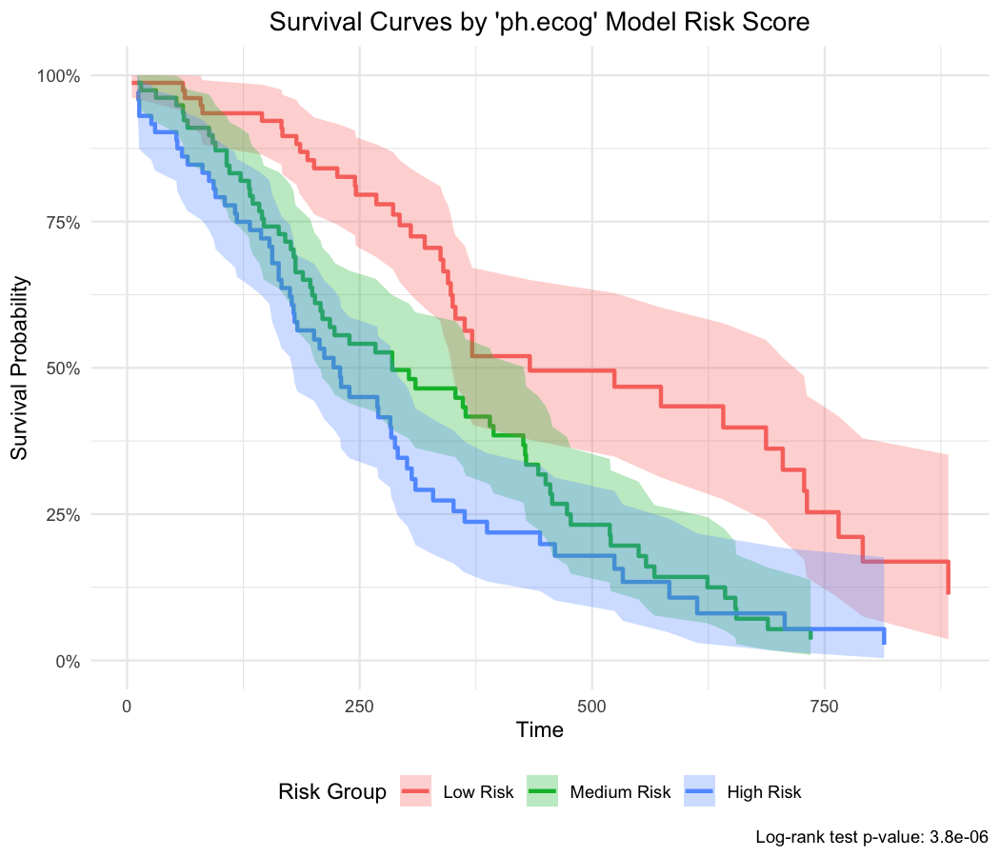

<!-- README.md is generated from README.Rmd. Please edit that file -->

# bregr: Easy and Efficient Batch Processing of Regression Models in R <a href="https://wanglabcsu.github.io/bregr/"></a>

<!-- badges: start -->

[](https://CRAN.R-project.org/package=bregr)
[](https://cran.r-project.org/package=bregr)
[](https://github.com/WangLabCSU/bregr/actions/workflows/R-CMD-check.yaml)
[](https://deepwiki.com/WangLabCSU/bregr)
<!-- badges: end -->

The **bregr** package revolutionizes batch regression modeling in R,
enabling you to run **hundreds of models simultaneously** with a clean,
intuitive workflow. Designed for both univariate and multivariate
analyses, it delivers **tidy-formatted results** and publication-ready
visualizations, transforming cumbersome statistical workflows into
efficient pipelines.

## Key Features

- 🚀 **Batch Processing**: Automate regression modeling across multiple
  dependent/independent variables.
- 📊 **Tidy Output**: Structured results compatible with `tidyverse` for
  seamless downstream analysis.
- 📈 **Integrated Visualization**: One-command forest plots and model
  diagnostics.
- ⚡️ **Unified Workflow**: Chain operations with native R pipes (`|>`).
- 📦 **Model Agnostic**: Supports linear models, Cox regression, and
  more.

## Batch Regression Modeling Overview

Batch regression streamlines analyses where:

- Each model shares **identical control variables** ($c_1$, $c_2$, …).
- **Focal predictors** ($x_1$, $x_2$, …) or **response variables**
  ($y_1$, $y_2$, …) vary systematically.

A simplified overview of batch regression modeling is given below for
illustration:

<p align="center">

</p>

## Installation

You can install the stable version of bregr from CRAN with:

``` r
install.packages("bregr")
```

Alternatively, install the development version from
[r-universe](https://wanglabcsu.r-universe.dev/bregr) with:

``` r
install.packages('bregr', repos = c('https://wanglabcsu.r-universe.dev', 'https://cloud.r-project.org'))
```

or from [GitHub](https://github.com/) with:

``` r
#install.packages("remotes")
remotes::install_github("WangLabCSU/bregr")
```

## Usage

Load package(s):

``` r
library(bregr)
#> Welcome to 'bregr' package!
#> =======================================================================
#> You are using bregr version 1.1.0.9000
#> 
#> Project home : https://github.com/WangLabCSU/bregr
#> Documentation: https://wanglabcsu.github.io/bregr/
#> Cite as      : arXiv:2110.14232
#> =======================================================================
#> 
```

Load data:

``` r
lung <- survival::lung |>
  dplyr::filter(ph.ecog != 3)
lung$ph.ecog <- factor(lung$ph.ecog)
```

bregr is designed and implemented following [Tidy design
principles](https://design.tidyverse.org/) and [Tidyverse style
guide](https://style.tidyverse.org/), making it intuitive and
user-friendly.

### Core workflow

Define and construct batch models:

``` r
mds <- breg(lung) |> # Init breg object
  br_set_y(c("time", "status")) |> # Survival outcomes
  br_set_x(colnames(lung)[6:10]) |> # Focal predictors
  br_set_x2(c("age", "sex")) |> # Controls
  br_set_model("coxph") |> # Cox Proportional Hazards
  br_run() # Execute models
#> exponentiate estimates of model(s) constructed from coxph method at default
```

### One-Step Pipeline

``` r
mds <- br_pipeline(
  lung,
  y = c("time", "status"),
  x = colnames(lung)[6:10],
  x2 = c("age", "sex"),
  method = "coxph"
)
```

Run in parallel:

``` r
mds_p <- br_pipeline(
  lung,
  y = c("time", "status"),
  x = colnames(lung)[6:10],
  x2 = c("age", "sex"),
  method = "coxph",
  n_workers = 3
)
#> exponentiate estimates of model(s) constructed from coxph method at default
#> ■■■■■■■                           20% | ETA: 46s
#>                                                  
```

``` r
all.equal(mds, mds_p)
#> [1] TRUE
```

Two global options have been introduced to control whether models are
saved as local files (`bregr.save_model`, default is `FALSE`) and where
they should be saved (`bregr.path`, default uses a temporary path).

### Output Inspection

Use `br_get_*()` function family to access attributes and data of result
`breg` object.

``` r
br_get_models(mds) # Raw model objects
#> $ph.ecog
#> Call:
#> survival::coxph(formula = survival::Surv(time, status) ~ ph.ecog + 
#>     age + sex, data = data)
#> 
#>               coef exp(coef)  se(coef)      z        p
#> ph.ecog1  0.409836  1.506571  0.199606  2.053  0.04005
#> ph.ecog2  0.902321  2.465318  0.228092  3.956 7.62e-05
#> age       0.010777  1.010836  0.009312  1.157  0.24713
#> sex      -0.545631  0.579476  0.168229 -3.243  0.00118
#> 
#> Likelihood ratio test=28.94  on 4 df, p=8.052e-06
#> n= 226, number of events= 163 
#> 
#> $ph.karno
#> Call:
#> survival::coxph(formula = survival::Surv(time, status) ~ ph.karno + 
#>     age + sex, data = data)
#> 
#>               coef exp(coef)  se(coef)      z       p
#> ph.karno -0.012238  0.987837  0.005946 -2.058 0.03957
#> age       0.012615  1.012695  0.009462  1.333 0.18244
#> sex      -0.485116  0.615626  0.168170 -2.885 0.00392
#> 
#> Likelihood ratio test=17.21  on 3 df, p=0.0006413
#> n= 225, number of events= 162 
#>    (1 observation deleted due to missingness)
#> 
#> $pat.karno
#> Call:
#> survival::coxph(formula = survival::Surv(time, status) ~ pat.karno + 
#>     age + sex, data = data)
#> 
#>                coef exp(coef)  se(coef)      z        p
#> pat.karno -0.018736  0.981439  0.005676 -3.301 0.000964
#> age        0.011672  1.011740  0.009381  1.244 0.213436
#> sex       -0.505205  0.603382  0.169452 -2.981 0.002869
#> 
#> Likelihood ratio test=23.07  on 3 df, p=3.896e-05
#> n= 223, number of events= 160 
#>    (3 observations deleted due to missingness)
#> 
#> $meal.cal
#> Call:
#> survival::coxph(formula = survival::Surv(time, status) ~ meal.cal + 
#>     age + sex, data = data)
#> 
#>                coef  exp(coef)   se(coef)      z      p
#> meal.cal -0.0001535  0.9998465  0.0002409 -0.637 0.5239
#> age       0.0149375  1.0150496  0.0106016  1.409 0.1588
#> sex      -0.4775830  0.6202808  0.1914559 -2.494 0.0126
#> 
#> Likelihood ratio test=10.1  on 3 df, p=0.0177
#> n= 179, number of events= 132 
#>    (47 observations deleted due to missingness)
#> 
#> $wt.loss
#> Call:
#> survival::coxph(formula = survival::Surv(time, status) ~ wt.loss + 
#>     age + sex, data = data)
#> 
#>               coef  exp(coef)   se(coef)      z       p
#> wt.loss -0.0002676  0.9997324  0.0062908 -0.043 0.96607
#> age      0.0199314  1.0201314  0.0097178  2.051 0.04027
#> sex     -0.5067253  0.6024652  0.1748697 -2.898 0.00376
#> 
#> Likelihood ratio test=13.87  on 3 df, p=0.003086
#> n= 212, number of events= 150 
#>    (14 observations deleted due to missingness)
br_get_results(mds) # Comprehensive estimates
#> # A tibble: 17 × 21
#>    Focal_variable term      variable  var_label var_class var_type   var_nlevels
#>    <chr>          <chr>     <chr>     <chr>     <chr>     <chr>            <int>
#>  1 ph.ecog        ph.ecog0  ph.ecog   ph.ecog   factor    categoric…           3
#>  2 ph.ecog        ph.ecog1  ph.ecog   ph.ecog   factor    categoric…           3
#>  3 ph.ecog        ph.ecog2  ph.ecog   ph.ecog   factor    categoric…           3
#>  4 ph.ecog        age       age       age       numeric   continuous          NA
#>  5 ph.ecog        sex       sex       sex       numeric   continuous          NA
#>  6 ph.karno       ph.karno  ph.karno  ph.karno  numeric   continuous          NA
#>  7 ph.karno       age       age       age       numeric   continuous          NA
#>  8 ph.karno       sex       sex       sex       numeric   continuous          NA
#>  9 pat.karno      pat.karno pat.karno pat.karno numeric   continuous          NA
#> 10 pat.karno      age       age       age       numeric   continuous          NA
#> 11 pat.karno      sex       sex       sex       numeric   continuous          NA
#> 12 meal.cal       meal.cal  meal.cal  meal.cal  numeric   continuous          NA
#> 13 meal.cal       age       age       age       numeric   continuous          NA
#> 14 meal.cal       sex       sex       sex       numeric   continuous          NA
#> 15 wt.loss        wt.loss   wt.loss   wt.loss   numeric   continuous          NA
#> 16 wt.loss        age       age       age       numeric   continuous          NA
#> 17 wt.loss        sex       sex       sex       numeric   continuous          NA
#> # ℹ 14 more variables: contrasts <chr>, contrasts_type <chr>,
#> #   reference_row <lgl>, label <chr>, n_obs <dbl>, n_ind <dbl>, n_event <dbl>,
#> #   exposure <dbl>, estimate <dbl>, std.error <dbl>, statistic <dbl>,
#> #   p.value <dbl>, conf.low <dbl>, conf.high <dbl>
br_get_results(mds, tidy = TRUE) # Tidy-formatted coefficients
#> # A tibble: 16 × 8
#>    Focal_variable term   estimate std.error statistic p.value conf.low conf.high
#>    <chr>          <chr>     <dbl>     <dbl>     <dbl>   <dbl>    <dbl>     <dbl>
#>  1 ph.ecog        ph.ec…    1.51   0.200       2.05   4.01e-2    1.02      2.23 
#>  2 ph.ecog        ph.ec…    2.47   0.228       3.96   7.62e-5    1.58      3.86 
#>  3 ph.ecog        age       1.01   0.00931     1.16   2.47e-1    0.993     1.03 
#>  4 ph.ecog        sex       0.579  0.168      -3.24   1.18e-3    0.417     0.806
#>  5 ph.karno       ph.ka…    0.988  0.00595    -2.06   3.96e-2    0.976     0.999
#>  6 ph.karno       age       1.01   0.00946     1.33   1.82e-1    0.994     1.03 
#>  7 ph.karno       sex       0.616  0.168      -2.88   3.92e-3    0.443     0.856
#>  8 pat.karno      pat.k…    0.981  0.00568    -3.30   9.64e-4    0.971     0.992
#>  9 pat.karno      age       1.01   0.00938     1.24   2.13e-1    0.993     1.03 
#> 10 pat.karno      sex       0.603  0.169      -2.98   2.87e-3    0.433     0.841
#> 11 meal.cal       meal.…    1.000  0.000241   -0.637  5.24e-1    0.999     1.00 
#> 12 meal.cal       age       1.02   0.0106      1.41   1.59e-1    0.994     1.04 
#> 13 meal.cal       sex       0.620  0.191      -2.49   1.26e-2    0.426     0.903
#> 14 wt.loss        wt.lo…    1.000  0.00629    -0.0425 9.66e-1    0.987     1.01 
#> 15 wt.loss        age       1.02   0.00972     2.05   4.03e-2    1.00      1.04 
#> 16 wt.loss        sex       0.602  0.175      -2.90   3.76e-3    0.428     0.849
```

### Visualization

#### Forest Plot (Key Results)

bregr mainly provides `br_show_forest()` for plotting data table of
modeling results.

``` r
br_show_forest(mds)
```



We can tune the plot to only keep focal variables and adjust the limits
of x axis.

``` r
br_show_forest(
  mds,
  rm_controls = TRUE, # Focus on focal predictors
  xlim = c(0, 3), # Custom axis scaling
  #   Use x_trans = "log" to transform the axis
  #   Use log_first = TRUE to transform both
  #       the axis and estimate table
  drop = 1 # Remove redundant columns
)
```



We also provide some interfaces from other packages for plotting
constructed model(s), e.g., `br_show_forest_ggstats()`,
`br_show_forest_ggstatsplot()`, `br_show_fitted_line()`, and
`br_show_fitted_line_2d()`.

For Cox-PH modeling results (focal variables must be continuous type),
we provide a risk network plotting function.

``` r
mds2 <- br_pipeline(
  survival::lung,
  y = c("time", "status"),
  x = colnames(survival::lung)[6:10],
  x2 = c("age", "sex"),
  method = "coxph"
)
#> exponentiate estimates of model(s) constructed from coxph method at default
```

``` r
br_show_risk_network(mds2)
#> please note only continuous focal terms analyzed and visualized
```



#### Model Score Prediction and Survival Curves

For Cox-PH models, you can generate model predictions (risk scores) and
create survival curves grouped by these scores:

``` r
# Generate model predictions
scores <- br_predict(mds2, idx = "ph.ecog")
#> `type` is not specified, use lp for the model
#> Warning: some predictions are NA, consider checking your data for missing
#> values
head(scores)
#>          1          2          3          4          5          6 
#>  0.3692998 -0.1608293 -0.2936304  0.1811648 -0.2493634  0.3692998
```

``` r
# Create survival curves based on model scores
br_show_survival_curves(
  mds2,
  idx = "ph.ecog",
  n_groups = 3,
  title = "Survival Curves by 'ph.ecog' Model Risk Score"
)
#> Warning: some predictions are NA, consider checking your data for missing
#> values
```



### Table

Show tidy table result as pretty table:

``` r
br_show_table(mds)
#>    Focal_variable      term estimate std.error statistic p.value     conf.int
#> 1         ph.ecog  ph.ecog1     1.51      0.20      2.05  0.040  [1.02, 2.23]
#> 2         ph.ecog  ph.ecog2     2.47      0.23      3.96  < .001 [1.58, 3.86]
#> 3         ph.ecog       age     1.01  9.31e-03      1.16  0.247  [0.99, 1.03]
#> 4         ph.ecog       sex     0.58      0.17     -3.24  0.001  [0.42, 0.81]
#> 5        ph.karno  ph.karno     0.99  5.95e-03     -2.06  0.040  [0.98, 1.00]
#> 6        ph.karno       age     1.01  9.46e-03      1.33  0.182  [0.99, 1.03]
#> 7        ph.karno       sex     0.62      0.17     -2.88  0.004  [0.44, 0.86]
#> 8       pat.karno pat.karno     0.98  5.68e-03     -3.30  < .001 [0.97, 0.99]
#> 9       pat.karno       age     1.01  9.38e-03      1.24  0.213  [0.99, 1.03]
#> 10      pat.karno       sex     0.60      0.17     -2.98  0.003  [0.43, 0.84]
#> 11       meal.cal  meal.cal     1.00  2.41e-04     -0.64  0.524  [1.00, 1.00]
#> 12       meal.cal       age     1.02      0.01      1.41  0.159  [0.99, 1.04]
#> 13       meal.cal       sex     0.62      0.19     -2.49  0.013  [0.43, 0.90]
#> 14        wt.loss   wt.loss     1.00  6.29e-03     -0.04  0.966  [0.99, 1.01]
#> 15        wt.loss       age     1.02  9.72e-03      2.05  0.040  [1.00, 1.04]
#> 16        wt.loss       sex     0.60      0.17     -2.90  0.004  [0.43, 0.85]
```

As markdown table:

``` r
br_show_table(mds, export = TRUE)
#> Focal_variable |      term | estimate | std.error | statistic | p.value |     conf.int
#> --------------------------------------------------------------------------------------
#> ph.ecog        |  ph.ecog1 |     1.51 |      0.20 |      2.05 |  0.040  | [1.02, 2.23]
#> ph.ecog        |  ph.ecog2 |     2.47 |      0.23 |      3.96 |  < .001 | [1.58, 3.86]
#> ph.ecog        |       age |     1.01 |  9.31e-03 |      1.16 |  0.247  | [0.99, 1.03]
#> ph.ecog        |       sex |     0.58 |      0.17 |     -3.24 |  0.001  | [0.42, 0.81]
#> ph.karno       |  ph.karno |     0.99 |  5.95e-03 |     -2.06 |  0.040  | [0.98, 1.00]
#> ph.karno       |       age |     1.01 |  9.46e-03 |      1.33 |  0.182  | [0.99, 1.03]
#> ph.karno       |       sex |     0.62 |      0.17 |     -2.88 |  0.004  | [0.44, 0.86]
#> pat.karno      | pat.karno |     0.98 |  5.68e-03 |     -3.30 |  < .001 | [0.97, 0.99]
#> pat.karno      |       age |     1.01 |  9.38e-03 |      1.24 |  0.213  | [0.99, 1.03]
#> pat.karno      |       sex |     0.60 |      0.17 |     -2.98 |  0.003  | [0.43, 0.84]
#> meal.cal       |  meal.cal |     1.00 |  2.41e-04 |     -0.64 |  0.524  | [1.00, 1.00]
#> meal.cal       |       age |     1.02 |      0.01 |      1.41 |  0.159  | [0.99, 1.04]
#> meal.cal       |       sex |     0.62 |      0.19 |     -2.49 |  0.013  | [0.43, 0.90]
#> wt.loss        |   wt.loss |     1.00 |  6.29e-03 |     -0.04 |  0.966  | [0.99, 1.01]
#> wt.loss        |       age |     1.02 |  9.72e-03 |      2.05 |  0.040  | [1.00, 1.04]
#> wt.loss        |       sex |     0.60 |      0.17 |     -2.90 |  0.004  | [0.43, 0.85]
```

As HTML table:

``` r
br_show_table(mds, export = TRUE, args_table_export = list(format = "html"))
```

## Documentation

All functions are documented in the [package
reference](https://wanglabcsu.github.io/bregr/reference/), with full
documentation available on the [package
site](https://wanglabcsu.github.io/bregr/).

## Coverage

``` r
covr::package_coverage()
#> bregr Coverage: 70.35%
#> R/98-utils.R: 58.17%
#> R/07-diagnostics.R: 63.41%
#> R/06-avail.R: 66.07%
#> R/04-show.R: 66.80%
#> R/04-show-nomogram-helpers.R: 68.59%
#> R/03-accessors.R: 75.31%
#> R/02-pipeline.R: 77.36%
#> R/01-class.R: 90.70%
#> R/99-zzz.R: 90.91%
#> R/05-polar.R: 92.37%
```

## Related/Similar Project(s)

- [ezcox: Easily Process a Batch of Cox
  Models](https://github.com/ShixiangWang/ezcox/)
- [autoReg](https://github.com/cardiomoon/autoReg/)
- [riskRegression](https://github.com/tagteam/riskRegression/)

## LICENSE

(GPL-3) Copyright (c) 2025 Shixiang Wang & WangLabCSU team
